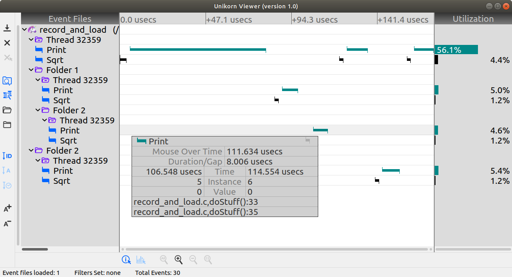

# Unikorn Software Event Analyzer
With the increased complexity of modern hardware and software, optimizing an application for performance is sometimes like trying to find a **unicorn**. Going green is more important than ever. Stop accepting poor performing software or using more hardware to fix bad performance. Unikorn is easy to use, and should be part of daily development from the application's inception to distribution.
<br><br>
Unikorn is a C API and graphical visualizer (Windows, Mac, and Linux). These are the simple steps to discovering the behaviour of your application:
1. Instrument your application with custom events (names and colors), a clock, and output stream to flush the events
2. Run your application; make sure the events get flushed
3. View the events in the Unikorn Viewer


## Building Unikorn's C Library
### Linux (gcc), Mac (xCode command line)
```
> cd unikorn/lib
> make RELEASE=Yes THREAD_SAFE=Yes
```
### Windows (Visual Studio console window)
Unikorn's API can optionally be thread safe, and if so requires Posix threads. Visual Studio does not have native support for Posix threads, so you'll need to download and build it:
1. Get the source code from: https://sourceforge.net/projects/pthreads4w/
2. Unzip, rename to 'pthreads4w' and put in the C:\ folder
3. Start a Visual Studio x64 native shell
```
> cd c:\pthreads4w
> nmake VC VC-debug VC-static VC-static-debug install DESTROOT=.\install
```
4. Build the Unikorn API
```
> cd unikorn\lib
> nmake -f windows.Makefile RELEASE=Yes THREAD_SAFE=Yes
```
## Instrumenting Your Application with Events
I'll step through the ```examples/hello1/``` example to get you familiar with event instrumentation.
First, include the Unikorn header file plus some helpful standard header files:
```C
#include "unikorn.h"
#include <stdio.h>
#include <stdlib.h>
```
Unikorn can record folders and events. Folders are just containers for holding groups of events, but are not required. Folders (if any) must be defined first. Each folder is assigned an ID and events are assigned a start ID and an end ID. IDs must start with 1 and each subsequent ID must be +1. Using a C `enum` makes this easy.  For this example, no folders will be defined, and we'll create events for two different sort routines:
```C
enum {
  // Folders
  // Events
  QUICK_SORT_START_ID=1,
  QUICK_SORT_END_ID,
  BUBBLE_SORT_START_ID,
  BUBBLE_SORT_END_ID
};
```
Next, define the events. Evends need a name and color:
```C
UkEventInfo events[] = {
  { "Quick Sort",  QUICK_SORT_START_ID,  QUICK_SORT_END_ID,  UK_BLUE},
  { "Bubble Sort", BUBBLE_SORT_START_ID, BUBBLE_SORT_END_ID, UK_RED}
};
```
Next, fill in the attribute structure that defines the properties of the event recording session:
```C
UkAttrs attrs = {
  .max_event_count = 10000,     // Max number of events that can be stored in the circular buffer
  .flush_when_full = false,     // Only record when the app explicitly calls ukFlush();
  .is_threaded = true,          // Record the thread ID; each thread will be displayed as a folder in the GUI
  .record_instance = true,      // Record the counter indicating how many times this event was recorded
  .record_value = true,         // Record a helpful 64 bit double value with the event
  .record_file_location = true, // Record the file name, function name, and line number where the event was recorded
  .folder_info_count = 0,
  .folder_info_list = NULL,
  .event_info_count = sizeof(events) / sizeof(UkEventInfo),
  .event_info_list = events,
};
```
Next, define a clock to record the current time. Unikorn does not include a built in clock because there are too many clocks to choose from and each clock has different properties. For this example, we'll just use a standard Unix/Windows clock:
```C
#ifdef _WIN32
  #define WIN32_LEAN_AND_MEAN
  #include <Windows.h>
  #include <sys/timeb.h>
#else
  #include <stddef.h>
  #include <sys/time.h>
#endif

uint64_t getEventTime() {
  static uint64_t base_time;
  static bool got_base_time = 0;
#ifdef _WIN32
  // A common Windows clock
  struct _timeb curr_time;
  _ftime64_s(&curr_time);
  uint64_t total_nanoseconds = (uint64_t)curr_time.time * 1000000000 + (uint64_t)curr_time.millitm * 1000000;
#else
  // gettimeofday() only has microsecond precision but is more portable
  struct timeval tp;
  gettimeofday(&tp, NULL);
  uint64_t total_nanoseconds = (uint64_t)tp.tv_sec * 1000000000 + (uint64_t)tp.tv_usec * 1000;
#endif
  if (!got_base_time) {
    base_time = total_nanoseconds;
    got_base_time = 1;
  }
  return (total_nanoseconds - base_time); // Return a time starting from 0 indicating when the app started
}
```
Next, need to create the output stream method. Typically this would be a file or a socket. For this example, we'll use a file:
```C
typedef struct {
  const char *filename;
  FILE *file;
  bool events_saved;
  bool append_subsequent_saves;
} FileFlushInfo;

bool prepareFileFlush(void *user_data) {
  FileFlushInfo *flush_info = (FileFlushInfo *)user_data;
  // Open a file
  const char *save_mode = "wb";
  if (flush_info->events_saved && flush_info->append_subsequent_saves) {
    save_mode = "ab";
  }
#ifdef _WIN32
  errno_t status = fopen_s(&flush_info->file, flush_info->filename, save_mode);
  if (status != 0) {
    return false;
  }
#else
  flush_info->file = fopen(flush_info->filename, save_mode);
  if (flush_info->file == NULL) {
    return false;
  }
#endif
  return true;
}

bool fileFlush(void *user_data, const void *data, size_t bytes) {
  FileFlushInfo *flush_info = (FileFlushInfo *)user_data;
  if (fwrite(data, bytes, 1, flush_info->file) == 1) return true;
  return false;
}

bool finishFileFlush(void *user_data) {
  FileFlushInfo *flush_info = (FileFlushInfo *)user_data;
  int rc = fclose(flush_info->file);
  return (rc == 0);
}

FileFlushInfo flush_info = {
  .filename = "./hello.events",
  .file = NULL,
  .events_saved = false,
  .append_subsequent_saves = false
};
```
All the components needed for creating the event recording session are now defined, so let's create it:
```C
void *session = ukCreate(&attrs, getEventTime, &flush_info, prepareFileFlush, fileFlush, finishFileFlush);
```
Now that the event session is created, you can start using the events throughout your application. To record a interesting section of source code, just record the start and stop events. This can be done around a single line of source code, or around a large block of source code:
```C
// Quick sort
ukRecordEvent(session, QUICK_SORT_START_ID, 0.0, __FILE__, __FUNCTION__, __LINE__);
myQuickSort(quick_sort_list, num_elements);
ukRecordEvent(session, QUICK_SORT_END_ID, 0.0, __FILE__, __FUNCTION__, __LINE__);

// Bubble sort
ukRecordEvent(session, BUBBLE_SORT_START_ID, 0.0, __FILE__, __FUNCTION__, __LINE__);
myBubbleSort(bubble_sort_list, num_elements);
ukRecordEvent(session, BUBBLE_SORT_END_ID, 0.0, __FILE__, __FUNCTION__, __LINE__);
```
This is an overly simple example, you might have dozzens of different types of events, and you might record millions of events over a short period of time. When you're ready to flush the events to file (this may be time consuming), all you need to do is:
```C
ukFlush(session);
```
When you're done recording events, then free the event session:
```C
ukDestroy(session);
```
That's it. If you want to try out the code from above, build and run the ```examples/hello1``` example
## Examples
To help you get started, some examples are provided
Example | Description
--------|------------
hello1 | The most basic example where everything is in a single C file
hello2 | A more realistic example where the event instrumentation comes from separate files, from the ```ref/``` folder, that can easily be excluded if event profiling is not needed
test_clock | Determine the overhead and precision of a clock that is used with event recording. Helpful if you need to characterize the behaviour of the clock.
record_and_load | A simple example used to validate the unikorn API and event loading file ```ref/events_loader.c```

## Developing Your Application
Event analysis should be used at all stages of development. Event instrumentation should be implementated in a way that is easy to compile out when not needed.
Some of the examples use reference files, from the ```ref/``` folder, in order to make it easy to remove event profiling when compiling. The files used with instrumenting are:
```
ref/event_clocks.c           # Some useful clocks for various OSes
ref/event_clocks.h           # Header file for event_clocks.c
ref/event_file_flush.c       # Functions to flush events to a file
ref/event_file_flush.h       # Header file for event_file_flush.c
ref/event_instrumenting.c    # Reusable code for defining an event session
```
The examples that use the reference files also use a header file ```event_instrumenting.h``` to define the custom folders and events.

## Developing a Visualizer or Post-Processing Application
If you are creating you own graphical visualizer, or just need to load events into some post-processing application, you can use the supplied source code to load the events:
```
ref/events_loader.c       # Code for load a .events file
ref/events_loader.h       # Header file for events_loader.c
```

## Visualizing Events with the Unikorn Viewer
The Unikorn Viewer is written in C++ using the Qt framework (www.qt.io).
### Linux (gcc), Mac (xCode command line)
```
> cd unikorn/visualizer
> qmake
> make
> ./UnikornViewer
```
### Windows (Visual Studio Qt console window)
```
> cd unikorn\visualizer
> qmake
> nmake
```
