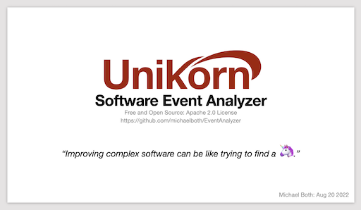

***"Improving complex software can be like trying to find a unicorn"***
<br>

# Unikorn Software Event Analyzer
Unikorn is a C API (source code, not a library) and graphical visualizer (Windows, Mac, and Linux) used to easily and quickly improve the design, performance, and reliability of complex software.

Just instrument your source code with meaningful events; you define the names and colors. Run your application, then view the results in UnikornViewer.


### Unikorn Presentation
View this presentation to learn the benefits of Unikorn and how to use it
<br>
<a href="Unikorn_Introduction.pdf">
  
</a>

### Stable Releases
In the 'Releases' section (right panel of the GitHub webpage, near the top), click on 'Latest' to get the latest stable release, including the pre-built viewer for Mac, Linux, and Windows. 

# Building
To instrument and build Unikorn into your application, do the following:

### Prepare Your Development Environment
OS | Requirements
--------|------------
Linux | gcc <br> make
Mac | xCode
Windows | Visual Studio<br><br> Unikorn's API can optionally be thread safe, which requires Posix threads (not supported in Visual Studio). To download and build it:<br> 1. Get the source code from: https://sourceforge.net/projects/pthreads4w/ <br> 2. Unzip, rename to 'pthreads4w' and put in the C:\ folder <br> 3. Start a Visual Studio x64 native shell <br> ```> cd c:\pthreads4w``` <br> ```> nmake VC VC-debug VC-static VC-static-debug install DESTROOT=.\install```


### Instrument Your Application with Events
Copy the file ```examples/hello/unikorn_instrumentation.h``` into your project to get started. View the
<a href="Unikorn_Introduction.pdf">Unikorn Introduction</a>
to see the details on how to instrument your application or just look at the ```examples/hello/hello.c``` to get started.
<br>

### Unikorn's Core Source Files
When using Unikorn in your application, you also need to compile in the following:
- The core Unikorn file
```
    src/unikorn.c                                # The event recording engine
```
- One of the Unikorn clock files (or your own custom clock file)
```
    src/unikorn_clock_gettime.c                  # A clock for Mac/Linux: high precision on most variations
    src/unikorn_clock_gettimeofday.c             # A clock for Mac/Linux: good precision and portable
    src/unikorn_clock_queryperformancecounter.c  # A clock for Windows: high precision
    src/unikorn_clock_ftime.c                    # A clock for Windows: not high precision
```
- Unikorn flushing (or your own custom flush functionality; e.g. socket)
```
    src/unikorn_file_flush.c                     # Flush event data to a file
```
The header files for the core, clock, and flush functionality:
```
    inc/unikorn.h
    inc/unikorn_clock.h
    inc/unikorn_file_flush.h
```

### Examples
To help you get started, some examples are provided
Example | Description
--------|------------
hello | Duh
multi_thread_and_file | Shows how multi-threaded processing can effect memory accesses. Also shows how multiple event files can be time aligned.
test_clock | Helpful if you need to characterize the overhead and precision of a clock.
test_record_and_load | A simple and full featured (including folders) example used to validate the unikorn API and event loading using ```src/unikorn_file_loader.c```


# Visualizer
UnikornViewer is written in C++ using the Open Source Qt framework (www.qt.io).<br>

Get the pre-built viewers from the 'Releases' section (right panel of the GitHub webpage, near the top), click on 'Latest' to get the latest release.<br>

To manualy build it yourself, do the following:<br>
*Tested with Qt 5.15.x*<br>
### Linux and Mac
```
> cd unikorn/visualizer
> qmake
> make -j8
> ./UnikornViewer
```
### Windows
```
> cd unikorn\visualizer
> qmake
> nmake
> release\UnikornViewer.exe
```

## Optionally Develop a Visualizer or Application to Analyze the Events
If you are creating you own graphical visualizer, or just need to load events into some post-processing application, you can use the supplied source code to load the events:
```
src/unikorn_file_loader.c       # Code for load a .events file
int/unikorn_file_loader.h       # Header file for unikorn_file_loader.c
```
