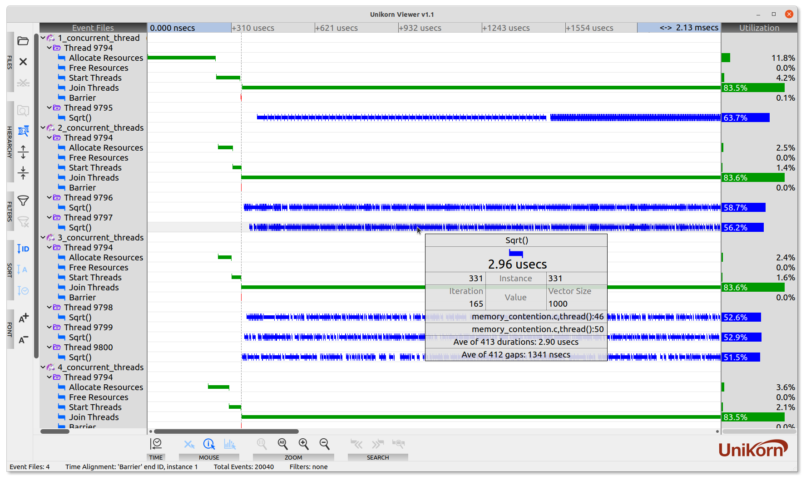

# Unikorn Software Event Analyzer
Unikorn is C API (source code, not a library) and graphical visualizer (Windows, Mac, and Linux) used to easily and quickly improve the design, performance, and reliability of complex software.

Even seasoned experts have difficulty fixing, tuning and improving software during development... like looking for a **unicorn**.

Just instrument your source code with meaningful events; you define the names and colors. Run your application, then view the results in UnikornViewer.


Unikorn is used to:
- Reveal sub-microsecond timing of key events, functions, code segments
- Validate complex dataflow interactions between CPU threads, processes, GPU streams, communication, IO devices, etc.
- Validate determinism even with long runs (e.g. hours, days)
- Implicitly see memory contention, thread starvation, context switches, and many other implicit events
- Find causality bugs: e.g. knowing what happened just before the application started failing

Unikorn is easy to use, and should be part of daily development from the application's inception to just before distribution.
<br>

## Download Unikorn
In the 'Releases' section (right panel of the GitHub webpage, near the top), click on 'Latest' to get the latest release, including the pre-built viewer for Mac, Linux, or Windows. 

## Prepare the OS Environment
To instrument and build your application, the following is needed:

OS | Requirements
--------|------------
Linux | gcc <br> make
Mac | xCode
Windows | Visual Studio<br><br> Unikorn's API can optionally be thread safe, which requires Posix threads (not supported in Visual Studio). To download and build it:<br> 1. Get the source code from: https://sourceforge.net/projects/pthreads4w/ <br> 2. Unzip, rename to 'pthreads4w' and put in the C:\ folder <br> 3. Start a Visual Studio x64 native shell <br> ```> cd c:\pthreads4w``` <br> ```> nmake VC VC-debug VC-static VC-static-debug install DESTROOT=.\install```


## Instrument Your Application with Events
The following is from  ```examples/hello/hello.c```.<br>
NOTE: All of the event recording source code is compiled out if ```ENABLE_UNIKORN_RECORDING``` is not defined when compiling.
```c
#define ENABLE_UNIKORN_SESSION_CREATION
#include "unikorn_instrumentation.h"
#include <stdio.h>

int main() {
  // Create event session
#ifdef ENABLE_UNIKORN_RECORDING
  UkFileFlushInfo flush_info; // Needs to be persistant for life of session
  // Arguments: filename, max_events, flush_when_full, is_threaded, record_instance, record_value, record_location, &flush_info
  void *unikorn_session = UNIKORN_INIT("./hello.events", 10000, false, false, true, true, true, &flush_info);
#endif

  // Print without recording
  printf("Hello!\n");

  // Record print
  UNIKORN_START_PRINT(unikorn_session, 0);
  printf("Hello!\n");
  UNIKORN_END_PRINT(unikorn_session, 42);

  // Folders and loops
  UNIKORN_OPEN_FOLDER_SOLAR_SYSTEM(unikorn_session);
  UNIKORN_START_FOR_LOOP(unikorn_session, 0);
  for (int j=0; j<5; j++) {
    UNIKORN_START_PRINT(unikorn_session, j);
    printf("Earth to Mars!\n");
    UNIKORN_END_PRINT(unikorn_session, 299792458);
  }
  UNIKORN_END_FOR_LOOP(unikorn_session, 0);
  UNIKORN_CLOSE_FOLDER(unikorn_session);

  // Another recorded print
  UNIKORN_START_PRINT(unikorn_session, 0);
  printf("Good Bye!\n");
  UNIKORN_END_PRINT(unikorn_session, 23.33);

  // Clean up
  UNIKORN_FLUSH(unikorn_session);
  UNIKORN_FINALIZE(unikorn_session);
#ifdef ENABLE_UNIKORN_RECORDING
  printf("Events were recorded. Use UnikornViewer to view the .events file.\n");
#else
  printf("Event recording is not enabled.\n");
#endif

  return 0;
}
```

The instrumentation is defined in ```examples/hello/unikorn_instrumentation.h```. Use this as the starting point for any application.
```c
#ifdef ENABLE_UNIKORN_RECORDING

#include "unikorn.h"
#include "unikorn_clock.h"
#include "unikorn_file_flush.h"
#include <stdlib.h>

// Define the unique IDs for the folders and events
enum {  // IMPORTANT, IDs must start with 1 since 0 is reserved for 'close folder'
  // Folders
  FOLDER_SOLAR_SYSTEM_ID=1,
  // Events
  FOR_LOOP_START_ID,
  FOR_LOOP_END_ID,
  PRINT_START_ID,
  PRINT_END_ID,
};

// IMPORTANT: Call #define ENABLE_UNIKORN_SESSION_CREATION, just before #include "unikorn_instrumentation.h", in the file that calls UNIKORN_INIT()
#ifdef ENABLE_UNIKORN_SESSION_CREATION

// Define custom folders
static UkFolderInfo L_folders[] = {
  // Name            ID
  { "Solar System",  FOLDER_SOLAR_SYSTEM_ID},
};
#define NUM_FOLDERS (sizeof(L_folders) / sizeof(UkFolderInfo))
// Use this if no folders are defined
//#define L_folders NULL
//#define NUM_FOLDERS 0

// Define custom events
static UkEventInfo L_events[] = {
  // Name        Color      Start ID            End ID           Start Value Name  End Value Name
  { "For Loop",  UK_BLACK,  FOR_LOOP_START_ID,  FOR_LOOP_END_ID, "",               ""},
  { "Print",     UK_BLUE,   PRINT_START_ID,     PRINT_END_ID,    "Loop Index",     "Favorite Number"},
};
#define NUM_EVENT_TYPES (sizeof(L_events) / sizeof(UkEventInfo))

// Init the event session
void *UNIKORN_INIT(const char *_filename, uint32_t _max_events, bool _flush_when_full, bool _is_threaded, bool _record_instance, bool _record_value, bool _record_location, UkFileFlushInfo *_flush_info) {
  UkAttrs attrs = {
    .max_event_count = _max_events,
    .flush_when_full = _flush_when_full,
    .is_threaded = _is_threaded,
    .record_instance = _record_instance,
    .record_value = _record_value,
    .record_file_location = _record_location,
    .folder_info_count = NUM_FOLDERS,
    .folder_info_list = L_folders,
    .event_info_count = NUM_EVENT_TYPES,
    .event_info_list = L_events
  };
  _flush_info->filename = _filename;
  _flush_info->file = NULL;
  _flush_info->events_saved = false;
  _flush_info->append_subsequent_saves = true;
  void *session = ukCreate(&attrs, ukGetTime, _flush_info, ukPrepareFileFlush, ukFileFlush, ukFinishFileFlush);
  return session;
}

#endif  // ENABLE_UNIKORN_SESSION_CREATION


// Cleanup functions
#define UNIKORN_FLUSH(_session) ukFlush(_session)
#define UNIKORN_FINALIZE(_session) ukDestroy(_session)

// Folder recording macros
#define UNIKORN_OPEN_FOLDER_SOLAR_SYSTEM(_session) ukOpenFolder(_session, FOLDER_SOLAR_SYSTEM_ID)
#define UNIKORN_CLOSE_FOLDER(_session) ukCloseFolder(_session)

// Events recording macros
#define UNIKORN_START_FOR_LOOP(_session, _value) ukRecordEvent(_session, FOR_LOOP_START_ID, _value, __FILE__, __FUNCTION__, __LINE__)
#define UNIKORN_END_FOR_LOOP(_session, _value)   ukRecordEvent(_session, FOR_LOOP_END_ID,   _value, __FILE__, __FUNCTION__, __LINE__)
#define UNIKORN_START_PRINT(_session, _value)    ukRecordEvent(_session, PRINT_START_ID,   _value, __FILE__, __FUNCTION__, __LINE__)
#define UNIKORN_END_PRINT(_session, _value)      ukRecordEvent(_session, PRINT_END_ID,     _value, __FILE__, __FUNCTION__, __LINE__)


#else


// Compile out all event recording macros
#define UNIKORN_FLUSH(_session)
#define UNIKORN_FINALIZE(_session)
#define UNIKORN_OPEN_FOLDER_SOLAR_SYSTEM(_session)
#define UNIKORN_CLOSE_FOLDER(_session)
#define UNIKORN_START_FOR_LOOP(_session, _value)
#define UNIKORN_END_FOR_LOOP(_session, _value)
#define UNIKORN_START_PRINT(_session, _value)
#define UNIKORN_END_PRINT(_session, _value)

#endif
```
When using Unikorn in your application, you also need to compile in the core unikorn file, a unikorn clock file (or your own custom clock file), and the unikorn flush file (or your own custom flush file):
```
src/unikorn.c                                # The event recording engine
src/unikorn_clock_gettime.c                  # A clock for Mac/Linux: high precision on most variations
src/unikorn_clock_gettimeofday.c             # A clock for Mac/Linux: good precision and portable
src/unikorn_clock_queryperformancecounter.c  # A clock for Windows: high precision
src/unikorn_clock_ftime.c                    # A clock for Windows: not high precision
src/unikorn_file_flush.c                     # Flush event data to a file
inc/*.h                                      # Header files
```

## Examples
To help you get started, some examples are provided
Example | Description
--------|------------
hello | Duh
memory_contention | A simple example to show how multi-threaded processing can effect memory.
test_clock | Helpful if you need to characterize the overhead and precision of a clock.
test_record_and_load | A simple and full featured (including folders) example used to validate the unikorn API and event loading using ```src/unikorn_file_loader.c```


## Visualize Events with the Unikorn Viewer
UnikornViewer is written in C++ using the Open Source Qt framework (www.qt.io).<br>

Get the pre-built viewers from the 'Releases' section (right panel of the GitHub webpage, near the top), click on 'Latest' to get the latest release.<br>

To manualy build it yourself, do the following:<br>
*Tested with Qt Qt 5.15.2*<br>
### Linux and Mac
```
> cd unikorn/visualizer
> qmake
> make -j8
> ./UnikornViewer
```
### Windows
```
> cd unikorn\visualizer
> qmake
> nmake
> release\UnikornViewer.exe
```

## Optionally Develop a Visualizer or Application to Analyze the Events
If you are creating you own graphical visualizer, or just need to load events into some post-processing application, you can use the supplied source code to load the events:
```
src/unikorn_file_loader.c       # Code for load a .events file
int/unikorn_file_loader.h       # Header file for unikorn_file_loader.c
```
